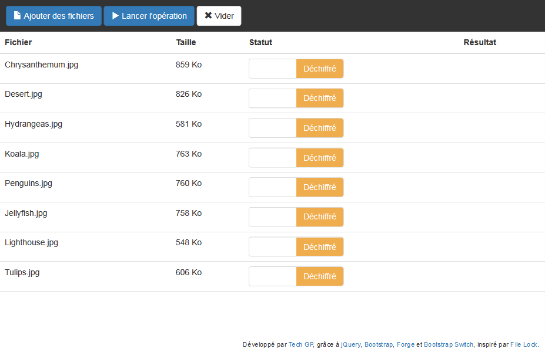
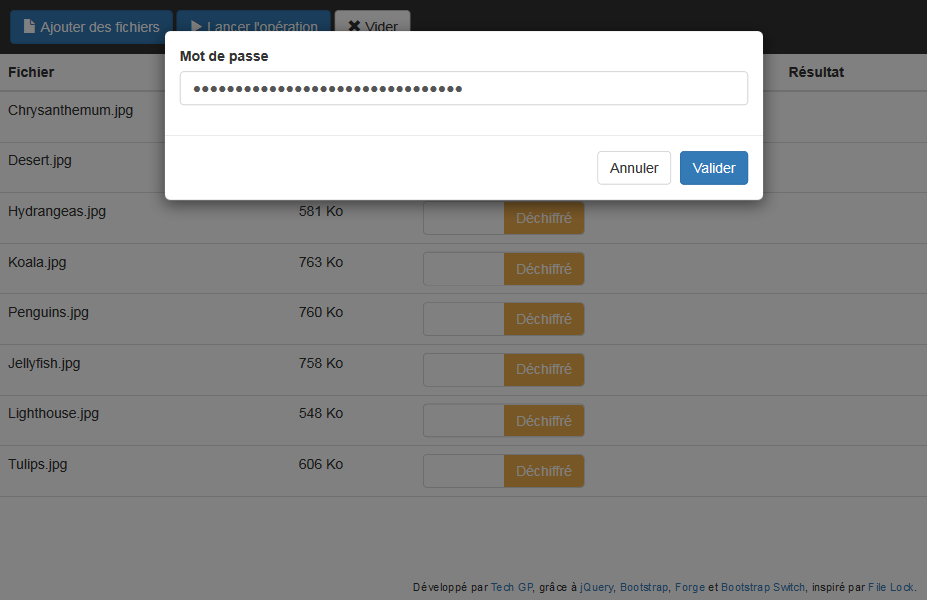
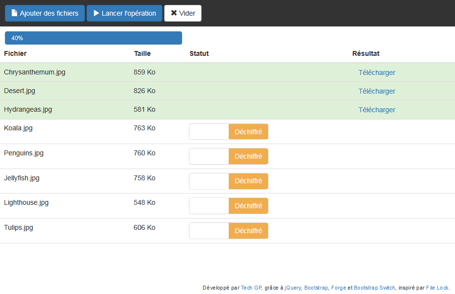
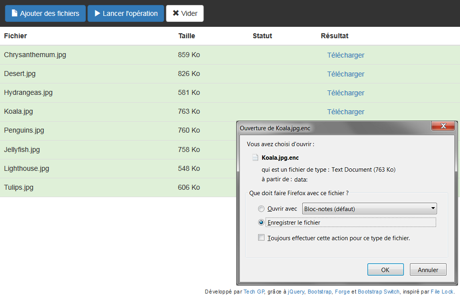

# webapps-cipher

File encryption using AES 256 bits in GCM mode

## Présentation

[Cette application](http://techgp.fr/webapps/webapps-cipher.html) écrite en HTML5, JavaScript et CSS3 vous permettra de chiffrer/déchiffrer des fichiers sensibles sans avoir besoin d'installer un programme. Tout se passe dans le navigateur.

L'application utilise les algorithmes suivants :

- [PBKDF2](https://fr.wikipedia.org/wiki/PBKDF2), [HMAC](https://fr.wikipedia.org/wiki/Keyed-Hash_Message_Authentication_Code) et [SHA-1](https://fr.wikipedia.org/wiki/SHA-1) pour générer la clef à partir de la phrase de passe
- [AES 256 bits](https://fr.wikipedia.org/wiki/Advanced_Encryption_Standard) avec une clef de 256 bits, en mode [GCM](https://fr.wikipedia.org/wiki/Galois/Counter_Mode) pour le chiffrement

Les librairies suivantes ont été utilisées pour cette application :

- [jQuery 2.1.4](http://jquery.com/)
- [Bootstrap 3.3.6](http://getbootstrap.com/css/)
- [Forge 0.6.39](https://github.com/digitalbazaar/forge)
- [Bootstrap Switch 3.3.2](https://github.com/nostalgiaz/bootstrap-switch)

L'application est fournie avec un fichier manifest `webapps-cipher.appcache` permettant la mise en cache et l'utilisation en mode déconnecté. Plus d'info chez Mozilla [en français](https://developer.mozilla.org/fr/docs/Utiliser_Application_Cache) ou [en anglais](https://developer.mozilla.org/en-US/docs/Web/HTML/Using_the_application_cache).

NB : quand le certificat HTTPS est incorrect, la mise en cache échouera sous Chrome avec l'erreur `Manifest fetch Failed (9)`. Dans ce cas, faites les tests en HTTP et/ou utilisez un certificat valide en production.

## Captures d'écran

### Présentation de l'IHM

### Saisie de la phrase de passe

### Affichage de la progression

### Récupération du résultat

### IHM adaptée aux petits écrans

## Licence

Ce projet est distribué sous licence MIT, reproduite dans le fichier LICENSE ici présent.

## Changelog

2016-03-07
- première version

2016-03-18
- ajout du favicon

2016-06-28
- ajout du fichier LICENCE
